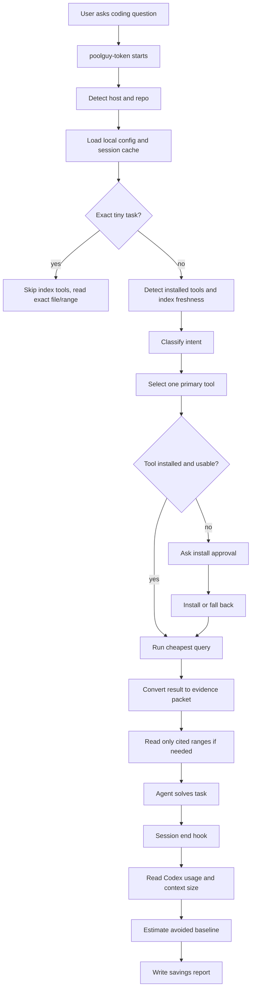
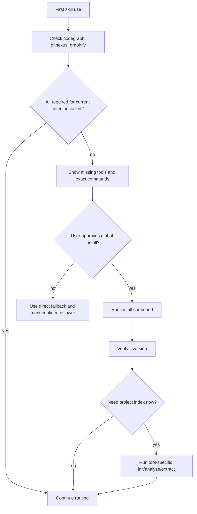
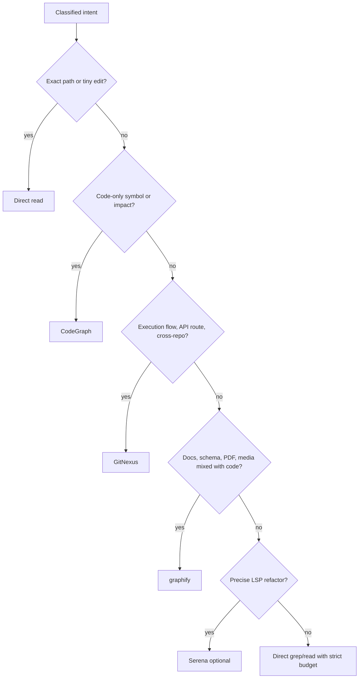
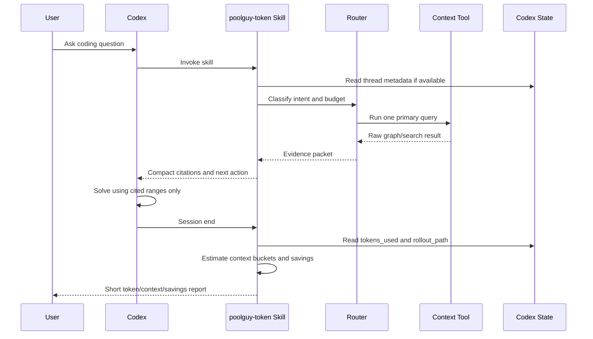
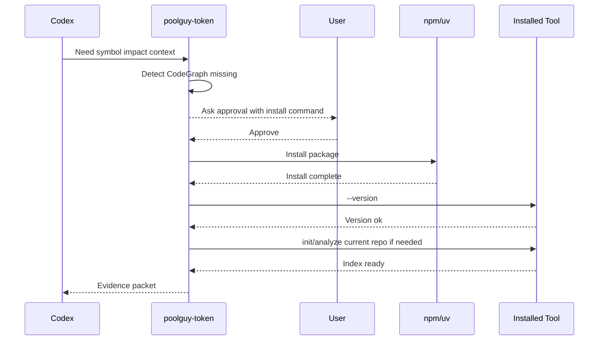
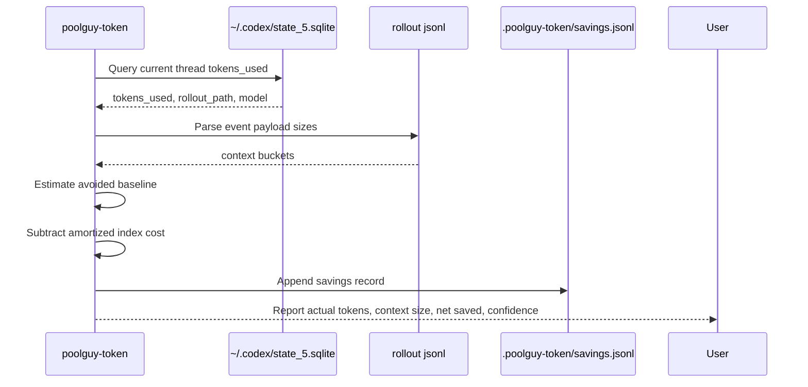

# poolguy-token Detailed Design

Date: 2026-07-16

## Purpose

`poolguy-token` is a Codex-first Agent Skill that reduces token use by routing
AI coding work to the cheapest useful context source.

It does not replace CodeGraph, GitNexus, or graphify. It chooses between them,
packs their output into small evidence packets, and reports token/context usage
after the session.

## Design Principles

1. Codex first, host adapters later.
2. Router over reimplementation.
3. One primary context tool per task.
4. Exact evidence beats broad context.
5. Real token counters when available, estimates clearly marked.
6. Global installs require user approval.
7. Small `SKILL.md`, long references loaded only when needed.

## V1 Scope

Included:

- Codex host adapter.
- Tool detector for CodeGraph, GitNexus, and graphify.
- Intent router.
- First-use install plan.
- Session usage and context-size reporting.
- Estimated savings report.
- Local state files.

Deferred:

- Full MCP server.
- Custom indexer.
- Non-Codex host implementations.
- Default install of Serena/FastContext/FastCode/LLMLingua.
- Exact billing-cost reporting when host does not expose price metadata.

## Directory Layout

```text
poolguy-token/
  SKILL.md
  README.md
  references/
    install.md
    measurement.md
    routing.md
    tools.md
  bin/
    ats-host-detect
    ats-host-codex
    ats-host-usage
    ats-detect
    ats-install
    ats-route
    ats-session-start
    ats-session-end
    ats-token-estimate
  docs/
    research-and-design.md
    detailed-design.md
```

`SKILL.md` should stay short. It loads only the reference file needed for the
current task.

## Local State

Project-local state:

```text
.poolguy-token/
  config.json
  sessions/
    <session-id>.json
  cache/
    evidence-packets.jsonl
    negative-cache.jsonl
  savings.jsonl
```

Example session record:

```json
{
  "session_id": "019f...",
  "host": "codex",
  "repo": "/path/to/repo",
  "git_sha": "abc123",
  "started_at": "2026-07-16T00:00:00Z",
  "primary_tool": "codegraph",
  "intent": "impact-analysis"
}
```

## Host Adapter Contract

All hosts return the same shape.

```json
{
  "host": "codex",
  "thread_id": "019f...",
  "tokens_used": 42180,
  "tokens_source": "codex.sqlite.threads.tokens_used",
  "rollout_path": "/home/user/.codex/sessions/...jsonl",
  "context": {
    "transcript_bytes": 640000,
    "tool_output_bytes": 220000,
    "code_context_bytes": 150000,
    "non_code_context_bytes": 70000,
    "repeated_context_bytes": 18000,
    "context_window_tokens": 110000,
    "context_pressure": 0.38
  },
  "estimated": false,
  "confidence": "high"
}
```

Codex v1 reads:

- `~/.codex/state_5.sqlite`
- `threads.tokens_used`
- `threads.rollout_path`
- rollout jsonl events for context-size estimates

If any source is missing, return partial data with `estimated=true`.

## Token And Context Measurement

### Actual Token Count

Codex v1:

1. Find the current thread from cwd, newest updated thread, or explicit thread id.
2. Read `threads.tokens_used`.
3. Record source as `codex.sqlite.threads.tokens_used`.

This is the primary token number.

### Context Size

Parse rollout jsonl and classify payloads:

| Bucket | Meaning |
|---|---|
| `user_text_bytes` | User messages. |
| `assistant_text_bytes` | Assistant messages. |
| `tool_call_bytes` | Tool names and arguments. |
| `tool_output_bytes` | Tool results shown to model. |
| `code_context_bytes` | File contents, snippets, diffs, stack traces. |
| `non_code_context_bytes` | Docs, web pages, planning prose. |
| `world_state_bytes` | Host-provided state. |
| `turn_context_bytes` | Host-provided per-turn context. |
| `repeated_context_bytes` | Duplicate chunks by hash. |

Token fallback:

```text
english_or_code_tokens = ceil(utf8_bytes / 4)
cjk_heavy_tokens = ceil(utf8_bytes / 2)
mixed_tokens = max(ceil(bytes / 4), ceil(cjk_chars * 1.5 + ascii_bytes / 4))
```

The report must show whether a value is actual or estimated.

### Savings Estimate

Use two numbers:

```text
gross_saved = baseline_estimated_tokens - actual_context_tokens
net_saved = gross_saved - index_cost_amortized_tokens
```

Baseline is estimated from avoided work:

| Avoided action | Baseline estimate |
|---|---|
| Full file read avoided | file bytes converted to tokens. |
| Broad grep avoided | expected grep output bytes converted to tokens. |
| Repeated tool call avoided | previous identical result token count. |
| Graph query vs manual exploration | files in evidence packet dependency set. |

Confidence:

- `high`: actual Codex token count plus parsed rollout data.
- `medium`: parsed rollout data plus tokenizer estimate.
- `low`: heuristic baseline only.

## Intent Router

Routing input:

- user request text
- current repo language/framework hints
- mentioned files/symbols
- existing index status
- current git diff
- installed tools

Routing output:

```json
{
  "intent": "impact-analysis",
  "primary_tool": "codegraph",
  "fallback_tool": "gitnexus",
  "reason": "symbol callers/callees requested in one repo",
  "budget": {
    "max_tool_output_tokens": 2500,
    "max_files_to_read": 3
  }
}
```

## Routing Matrix

| Intent | Primary | Fallback | Skip tools when |
|---|---|---|---|
| exact file edit | direct read | CodeGraph | user named exact path and change is local |
| symbol lookup | CodeGraph | Serena | symbol is already in current context |
| impact analysis | CodeGraph | GitNexus | one private helper has no callers |
| execution flow | GitNexus | CodeGraph | only one file involved |
| API route impact | GitNexus | CodeGraph | route file is already known |
| cross-repo impact | GitNexus | graphify | repo group not configured |
| docs + code question | graphify | direct read | docs are tiny |
| PDFs/media/schema | graphify | direct read | file is small and explicitly named |
| diff review | git diff first | GitNexus detect_changes | no diff exists |
| unknown repo exploration | FastContext style packet | CodeGraph | repo has fewer than ~20 files |

## Evidence Packet

All tool output should be converted to this shape before entering the main
reasoning context:

```json
{
  "tool": "codegraph",
  "query": "impact UserService.validate",
  "summary": "3 callers across auth and checkout",
  "citations": [
    {
      "path": "src/auth/session.ts",
      "lines": "42-88",
      "symbol": "validateSession",
      "why": "direct caller"
    }
  ],
  "next_action": "read cited line ranges only",
  "confidence": "high"
}
```

The packet is cached by:

```text
sha256(repo_sha + tool + query + normalized_intent)
```

## Main Flow



## First-Use Install Flow



## Tool Selection Flow



## Sequence: Normal Codex Session



## Sequence: Missing Tool Install



## Sequence: Session End Measurement



## Session End Report Format

```text
poolguy-token report
actual tokens: 42,180 (Codex sqlite)
context: 38% of 110k, 18,420 tool-output tokens estimated
saved: 18,820 net estimated tokens
confidence: medium
top saver: CodeGraph avoided 9 full-file reads
```

## More Ways To Save Tokens

Rules to encode in v1:

1. Do not index for exact-file edits.
2. Prefer `git diff` over whole repo for review/debug after edits.
3. Query one graph tool first, not all three.
4. Cache positive and negative query results by repo SHA.
5. Convert raw tool output to evidence packets.
6. Read line ranges, not whole files.
7. Ask graph tools for symbol skeletons before bodies.
8. Fetch callers before editing shared functions.
9. Maintain generated/vendor denylist.
10. Keep a compaction checkpoint with current task, files, decisions, and open
    questions.
11. Drop unrelated logs; keep exact errors and failing assertions.
12. Use cheap explorer subagents only when they can access the same index.
13. Amortize index cost over repo/SHA sessions.
14. Stop searching once there is enough evidence to edit and test.
15. Ask before broad repo audits.
16. Prefer root-cause edits over caller-by-caller guards.
17. Store evidence packets so future turns avoid rediscovery.
18. Keep the skill itself small through progressive references.

## Implementation Order

1. Create `SKILL.md` with Codex-first routing and references.
2. Implement `bin/ats-host-codex` using Python stdlib sqlite/json.
3. Implement `bin/ats-token-estimate`.
4. Implement `bin/ats-detect` for CodeGraph/GitNexus/graphify.
5. Implement `bin/ats-route` as a small rule table.
6. Add `bin/ats-session-end` report generation.
7. Add smoke tests with assert-based scripts.

Skipped in v1: custom graph indexer. Add one only if the three existing tools
cannot cover a measured gap.

